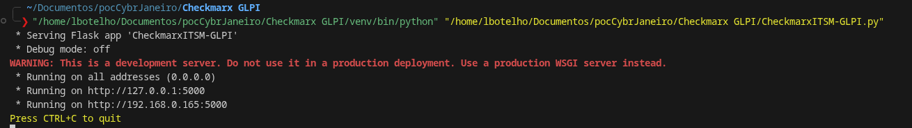

# Introdução
Pegar os dados de um scan realizado após um commit e gerar chamados dentro do GLPI.

# Fluxo
- Realizar commit 
- Scan Gerado automaticamente pelo Commit 
- Webhook apontado para um python informando o Scan ID do projeto. Roda automaticamente após o scan completo
- Código Python pega esse scan e faz uma chamada na API da Checkmarx buscando as vulnerabilidades novas do projeto
- Código Python bate na API do GLPI que o Marcos mandou e Cria os chamados
- 
# Requisitos
- Python 3.11.2

#Apresentação
1. Preparação do script
- Garanta que o script "CheckmarxITSM-GLPI.py" esteja rodando.

2. Repositório Integrado
3. Consultar GLPI
