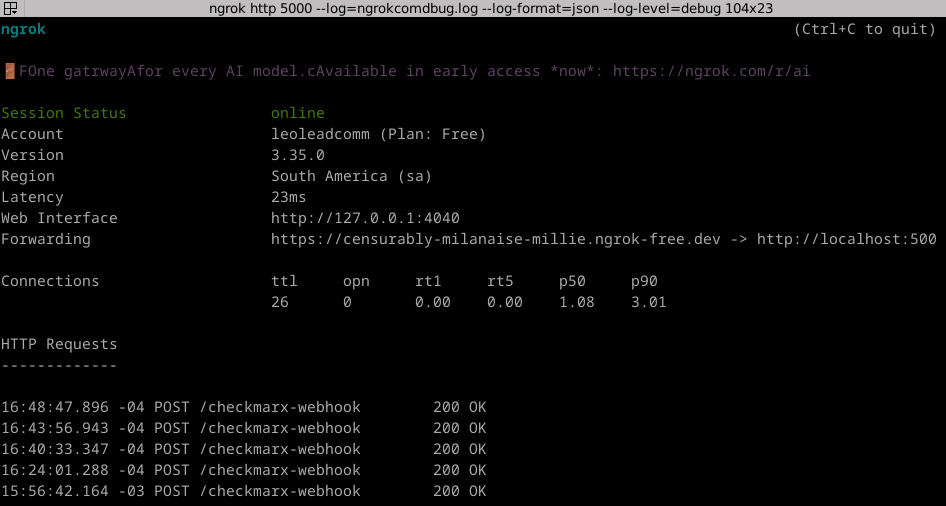
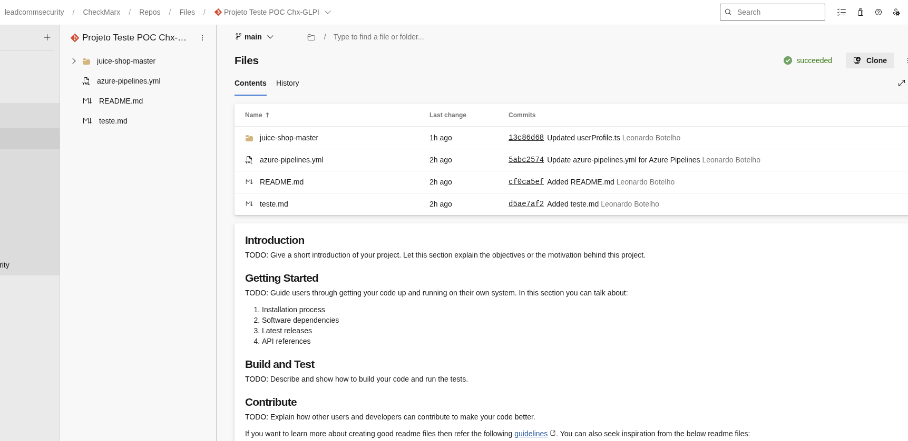
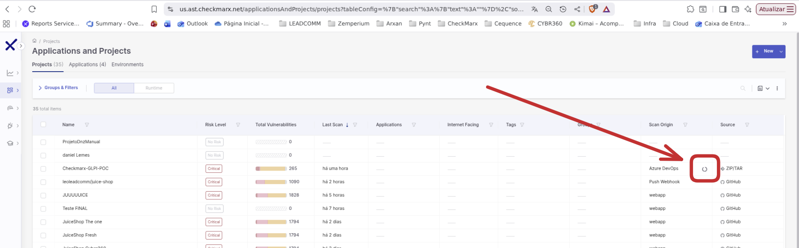
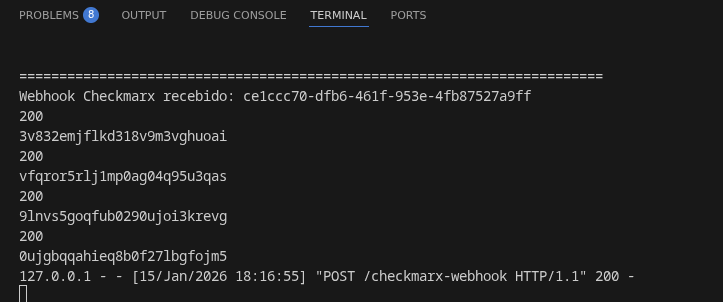
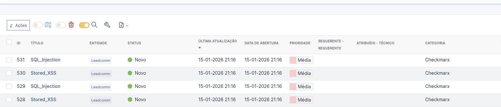

# Introdução
Pegar os dados de um scan realizado após um commit e gerar chamados dentro do GLPI.

# Fluxo
- Realizar commit 
- Scan Gerado automaticamente pelo Commit 
- Webhook apontado para um python informando o Scan ID do projeto. Roda automaticamente após o scan completo
- Código Python pega esse scan e faz uma chamada na API da Checkmarx buscando as vulnerabilidades novas do projeto
- Código Python bate na API do GLPI e Cria os chamados
- 
# Requisitos
- Python 3.11.2

#Apresentação
1. Preparação do script
- Garanta que o script "CheckmarxITSM-GLPI.py" esteja rodando. Ele que irá receber o Webhook do Checkmarx e iniciar o processo para abertura do ticket.
- Garanta que o mesmo pode ser acessado de fora da rede interna, No meu exemplo estou utilizando o Ngrok para que o Checkmarx alcançe minha API.

2. Repositório Integrado
- Agora faça com que a Pipeline entre em execução, ou realizando alterações no código de amostra(Juiceshop). Ou você também pode rodar a Pipeline manualmente.

3. Consultar o Checkmarx 
- Valide se o scan foi triggado dentro do Checkmarx, aparecerá um icone de carregamento ao lado do projeto. 

4. Valide se o Webhook chegou
- Após isso verifique se o Webhook ao final do scan bateu no scriptAPI

5. Valide se o Ticket foi criado
- Dentro do GLPI de testes, valide se os chamados foram criados. Nota: O conteúdo dos chamados pode ser personalizado, o resultado atual não relete todas as informações possíveis.
- 
